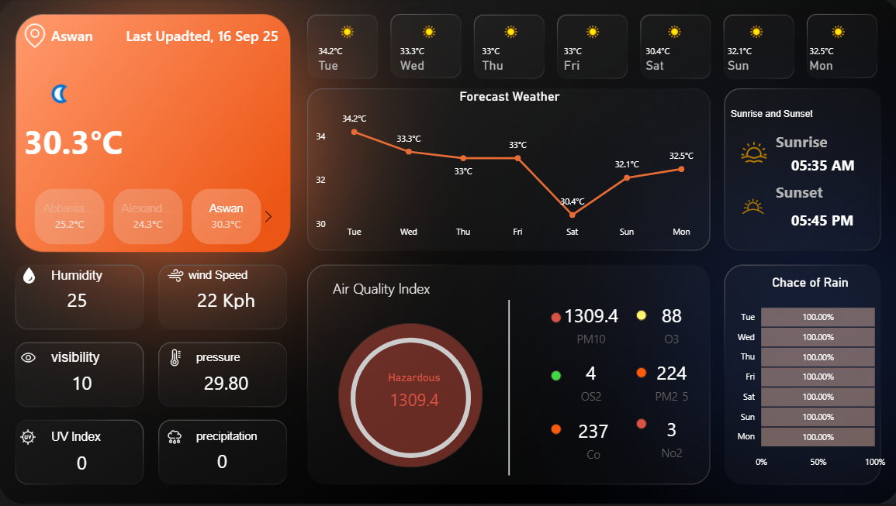

# Weather-Insights-Dashboard
A real-time interactive Weather &amp; Air Quality Dashboard built with Power BI, using Weather API, Power Query, and DAX to visualize temperature, humidity, wind speed, air pollution levels, and forecast trends across Egyptian cities.

🌦️ Weather Insights Dashboard – Power BI Project
📋 Overview

This project presents a Weather Insights Dashboard built in Power BI, designed to visualize real-time and forecasted weather conditions across multiple cities in Egypt.
The goal was to create a fully automated, data-driven dashboard that retrieves live weather data via an API, processes it dynamically through Power Query, and delivers key insights using DAX measures.

🎯 Objective

To design an interactive dashboard that:

Fetches live weather data automatically from an online API.

Displays key metrics like temperature, wind speed, humidity, and rain probability.

Allows users to compare weather conditions across different Egyptian cities.

Updates dynamically based on the latest available data.

🧰 Tools & Technologies
Category	Tools / Languages
Data Source	Weather API (https://www.weatherapi.com
)
Data Processing	Power Query (M language)
Data Modeling	Power BI (DAX)
Visualization	Power BI Desktop
Other Skills Used	API Integration, Data Cleaning, Data Modeling, Dashboard Design
🔗 Data Source & API Integration

Weather data was retrieved directly from the Weather API endpoint in JSON format, using Power BI’s built-in Web Connector.
Each API request provided two main datasets:

Current Weather Data – including temperature, wind speed, humidity, and “last updated” time.

Forecast Data – containing daily weather averages, temperature, and rain probability.

Through Power Query, the JSON was parsed and transformed into structured relational tables (Current, Forecast_Day), which were later connected in Power BI’s data model.

🧩 Power Query (Data Transformation)

All data transformations were done using Power Query.
Key steps included:

Expanding nested JSON objects into columns.

Renaming columns for clarity and consistency.

Converting data types (e.g., text → numeric, date/time formatting).

Creating new columns for city name, date, and formatted timestamps.

Removing unnecessary attributes to improve refresh speed.

This ensured clean, optimized data ready for DAX modeling.

🧮 DAX Implementation

Dynamic DAX measures were created to summarize and format weather metrics for visual representation.

| **Measure Name**      | **Description**                                  | **Formula**                                                                                  |
| --------------------- | ------------------------------------------------ | -------------------------------------------------------------------------------------------- |
| **Curr_Temp_C**       | Displays the current temperature in Celsius.     | `SUM('Current'[current.temp_c]) & "°C"`                                                      |
| **For_Temp_C**        | Calculates average forecast temperature.         | `AVERAGE(Forcast_Day[forecast.forecastday.day.avgtemp_c]) & "°C"`                            |
| **Last_Updated_Date** | Shows the date and time of the last data update. | `"Last Updated, " & FORMAT(FIRSTNONBLANK('Current'[current.last_updated], ""), "dd mmm yy")` |
| **Wind_Speed**        | Displays wind speed in kilometers per hour.      | `SUM('Current'[current.wind_kph]) & " Kph"`                                                  |
| **Left_Value_Rain**   | Calculates the percentage of non-rainy days.     | `100 - SUM(Forcast_Day[forecast.forecastday.day.daily_chance_of_rain])`                      |
| **Day_Name**          | Extracts and formats the forecasted day name.    | `FORMAT(Forcast_Day[forecast.forecastday.date], "ddd")`                                      |

📊 Dashboard Features

Real-time updates directly from the Weather API.

Dynamic cards showing temperature, wind, humidity, and rain chance.

Forecast comparison charts for upcoming days.

City-based filters to switch between different Egyptian locations.

Clean, modern Power BI interface with intuitive visuals and icons.

🧠 Key Insights

Provides a quick view of Egypt’s weather trends (current & forecast).

Displays patterns in temperature and rain probability.

Automates data updates with every API refresh.

Combines Power BI, Power Query, and DAX in one integrated workflow.

💡 Skills Demonstrated

API Data Extraction

Data Cleaning & Transformation (Power Query)

DAX Calculations & KPIs

Interactive Dashboard Design

Data Storytelling

🚀 Outcome

This project showcases a complete data pipeline inside Power BI, from connecting to an external API, cleaning JSON data, modeling relationships, to creating visually compelling insights through DAX and reports.
It demonstrates strong skills in data analysis, automation, and business intelligence development.

🖼️ Dashboard Preview

Below is a sample preview of the interactive Weather Dashboard created in Power BI.
You can replace this section with your actual dashboard image when uploading to GitHub:

